## ***TripleA  Rule Book***

__The World’s Foremost Open-Source Grand Strategy Game__

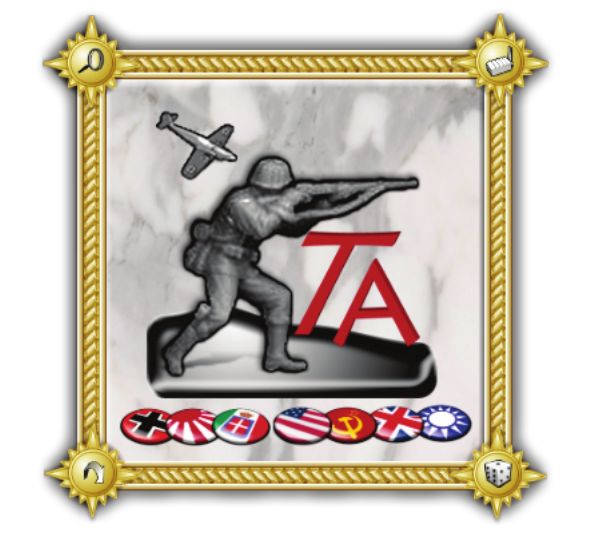

  

## Table of Contents

* [Overview](#overview)
* [Game Setup](#game-setup)
* [The Game Screen](#The-Game-Screen)
* [The Map](#the-map)
* [Capitals](#Capitals)
* [The Units](#The-Units)
* [Units Used in “Big World : 1942”](#Units-Used-in-“Big-World-:-1942”)
* [Sequence of Play](#sequence-of-play)
* [Technology Development](#technology-development) 
* [Purchase](#purchase)
* [Combat Movement](#combat-movement)
* [Battle](#battle)
* [Non-Combat Movement](#non-combat-movement)
* [Placement](#placement)
* [End-Turn](#end-turn)
* [Winning the Game](#winning-the-game)
* [The Undo Feature](#the-undo-feature)
* [Low Luck vs. Dice](#low-luck-vs.-dice)
* [The Battle Calculator](#the-battle-calculator)
* [Menus & Tabs](#menus-and-tabs)
* [Credits](#credits)
* [Links](#links)
* [Appendices & Additional Content](#appendices-and-additional-content)
* [Example of Play: 1st Turn Walkthrough of Russians in “Big World : 1942”](#)
* [Pulicat’s Tactical Handbook](#pulicats-tactical-handbook)

  

## <a id="overview" /> 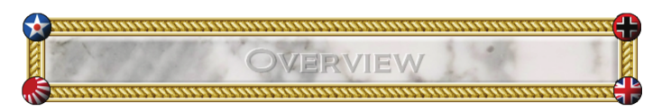

  
TripleA is a turn-based strategy game and board game engine. Though TripleA comes with many games inside, it
is just an engine for playing games, and is not a game itself. TripleA started out as a World War II simulation, but
has since expanded to include different conflicts, as well as variations and mods of popular games and maps (a
‘map’ is like a board, while a ‘game’ is a specific setup on a map/board).
  
This manual describes how to use and play TripleA, using the game “Big World : 1942”, a basic variant. The two
most popular WWII maps for beginners are “Pact of Steel” and “Big World”, and Big World has a lot more
territories and a one more unit type than Pact of Steel, while the rules are almost exactly the same. Other TripleA
games and variants can still use this manual as a good starting point, because the game engine and most of the
concepts are the same no matter what map or conflict you are playing.
  
This manual does not attempt to describe 100% of the game functions. There are just too many things that the
game can do to make that practical. Some of the game interfaces and operations are intended for developers.
Many of the game operations simply happen automatically, and illegal player actions are prevented. A certain
amount of knowledge and initiative is expected of the player, especially to read any game notes for any maps.
However, all of the critical and important game operations and knowledge are described in this manual.
  
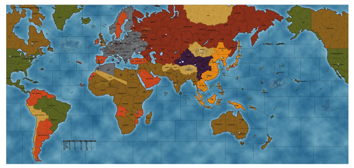
  

## <a id="game-setup"/> 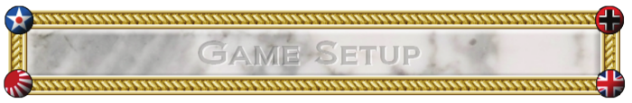

The first thing that happens when TripleA is started is that the game setup window appears. There are a number
of choices that the player must make at this time.

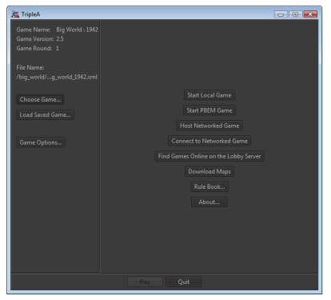

* The game variant must be selected,
OR a saved-game must be loaded.
* Approximately 10 or more variants
are automatically included with the
game, and more can be
downloaded.
* The game options should be set,
but the default ones could be used.
* A local, pbem, or network game can
be started, OR you can join the
online lobby instead. (Even if
loading a savegame, you must still
select ‘start local game’ or ‘start
pbem game’ or ‘host networked
game’)
* Each player can be set to be a
human or an AI.

A few other options are also available at
this time, but they can be ignored for now.

## <a id="the-game-screen"/> 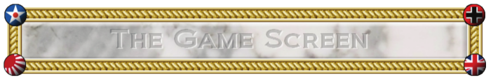

Below is a screenshot taken while in-game, playing the “Big World : 1942” map.

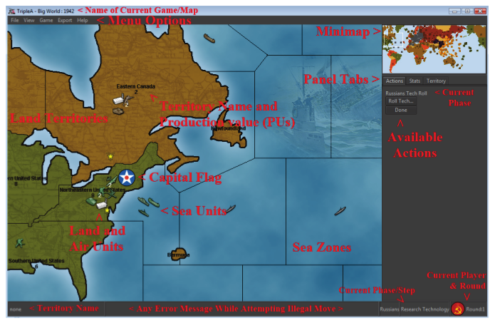

Usually, the main screen cannot display the whole world at once, and instead only shows part of the map. The
part that is displayed can be rapidly moved or changed in three ways:

* By moving the cursor to just inside the edge or corner of the main map window, at which point the map
will scroll in that direction. Scrolling the mouse wheel will also scroll the map up and down.
* By ‘right-clicking’ on the main screen and dragging your mouse to move around the map.
* By clicking or clicking and dragging on the minimap in the upper right-hand corner.

In addition, you can change the Zoom Level of the map by either going to the “View” menu and selecting “Zoom”,
or by holding down the “ALT” key while scrolling your mouse wheel.

## <a id="the-map"/> 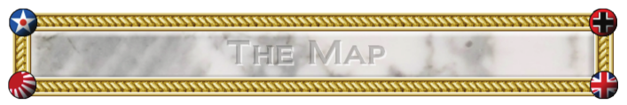

Each TripleA map is divided into a number of areas. Land areas are called territories. Sea areas are called sea
zones. Short or narrow rivers and small islands generally play only a cosmetic role (if an area has no name when
you scroll your mouse over it, then it is just cosmetic and not an actual territory or sea zone). Air units fly over top
of all this, but need to land at the end of every turn.
  
Each map area is adjacent to a certain number of other areas. Units move about the map, from one area to an
adjacent area; as a general rule, teleportation does not exist.
  
Land units are restricted to land territories unless they are being carried by transports. Sea units are restricted to
sea zones. This means that land and sea units generally cannot attack each other.
  
Sea units can generally move to any adjacent sea zones, but there is one exception to this rule: Canals. Canals are
connected sea zones that require ownership of attached land territories in order to pass through. For example, at
the Suez Canal, sea units can move north and south via the canal, but only if the land territories on both sides of
the canal are controlled by friendly or allied nations at the beginning of your turn.
  
Each territory has a production value (Production Units, or PUs for short), which could be as low as zero. It is
possible for sea zones to be assigned production values as well, in which case they would be called ‘convoy
centers’. The production value of a land territory determines how many units can be produced there per turn,
but, primarily it determines how much income that territory provides per turn to the player controlling it.
Each land territory is always controlled by some player, except for some territories that are initially neutral or are
impassible to all players. A territory can change hands if an enemy land unit conquers and occupies it. Some land
units, such as Anti-Aircraft guns (AA Guns), cannot attack and conquer a territory. The color of the territory on
the map indicates who controls it.
  
The player who controls a particular territory receives the income from it at the end of that player’s turn. Control
of a territory may change many times in a game round, and the territory will still produce its full income with each
change of control.
  
Certain territories contain “Factory” units, which allow the controlling player to produce units in that territory. A
territory with a factory may produce a number of units up to the production value of the territory, if the player
owned that territory at the beginning of their turn. When a player conquers a territory containing a Factory or AA
Gun, those units will be captured with the territory, and the conquering player may use them on their next turn.
  
The territories that a player starts the game with are considered to be “originally” owned by that player, unless
otherwise specified. If an ally ever recaptures such a territory, control of the territory (and its resources and
capture-able units) will revert to the original owner. In this case, the income for the territory is not collected by
the capturing player, and instead it will be collected by their ally, the original owner, at the end of their turn,
  
Provided that they still own it at that time. Of course, enemy players are not bound by such considerations and
control whatever they capture.

## <a id="capitals"/> 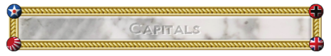

Each of the nations in TripleA has a capital territory. These territories are
indicated on the map by a large roundel or flag associated with that nation. 

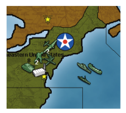

If an enemy player captures one of these territories, there are drastic consequences.

* All of the production units (PUs) in the victim’s bank are immediately
transferred to the treasury of the capturing player.
* The victim does not collect any income while the capital is in enemy
hands.
* The victim cannot produce any units while the capital is in enemy
hands. Of course, he has no resources to produce those units in any
case.

## <a id="the-units"/> 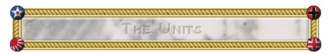

As most games on TripleA are “grand strategy” games, a “unit” does not represent a single infantry or tank, but
instead represents an entire army that is based around infantry or tanks. Therefore an “infantry” unit would
include within it its own logistics train, supplies, anti-air/tank weapons, etc. Unless specified, all units can hit all
other units.
  
Each TripleA unit has certain properties, which are expressed as a set of numbers. These properties are Attack
(Att), Defense (Def), Movement (Move), Cost (PUs), Hit-Points, Size, and maybe some special properties or
abilities.
  

* **Attack** is the firepower when a unit is attacking. The unit gets one hit by rolling that number or less on a 6-sided
die.
* **Defense** is the firepower when a unit is defending. The unit gets one hit by rolling that number or less on a 6sided die.
* **Movement** is the number of map territories or sea zones that the unit can move each turn (except when being
carried by a transport). A unit with a Movement of 1 can move to one adjacent area, and so forth.
* **Cost** is how many PUs must be spent to produce one of that unit.
* **Size** indicates how much transport or carrier capacity is required to move a land or air unit by sea.
* **Hit-Points**  indicates how many hits this unit must suffer before it dies. Almost all units in TripleA have only 1
hitpoint, meaning that they die after the first hit. Some special units, like Battleships, may have 2 hitpoints, which
allows them to absorb enemy fire, and possibly repair if they survive the battle.
  
Important special properties and abilities are things such as being able to Blitz, or being able to increase the attack
power of another unit when they are in the same territory (called giving and receiving “support”), or being able to
shoot at aircraft as they fly over, or being able to produce units.

## <a id="units-used-in-big-world-1942" /> 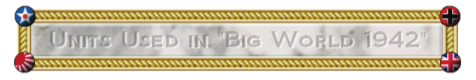

The following units and stats are particular to the game “Big World : 1942”, and therefore if you try playing a
different map, the units might differ slightly. For example, “Pact of Steel” has no “Cruisers” and the “Destroyers”
cost more and have higher attack and defense. In some maps not based on World War II, the units may differ
radically. For example, “Lord of the Rings: Middle Earth” has completely different units, different art, and
different stats.

<a id="infantry"/>

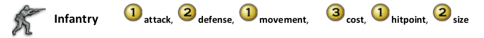

__Special Abilities:__

* Infantry may receive support. This means when they are paired with Artillery units on a 1-to-1
basis, the infantry units will receive +1 attack power.

__Notes:__ Infantry is generally slow and cheap with a high defense. Accordingly, its primary missions are to
defend territories and to absorb casualties. Despite their lower attack and defense, they still have just as
many hitpoints as more expensive units, so it is very good to keep more infantry than any other unit.

<a id="artillery" /> 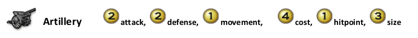

__Special Abilities:__
* Artillery may give support. So as an example, if you had 3 infantry and 2 artillery, then 2 of the
infantry would receive support and have their attacks increased to 2, while the 3rd infantry would
stay at 1 attack. The support is not cumulative, so 1 infantry with 2 artillery would only receive 1
support.

__Notes:__ Artillery is used to increase the attacking effectiveness of your infantry stacks. It is generally good
to have a few artillery with every large stack of infantry, as it is a very cost effective way of increasing the
firepower of your army.

<a id="tank"/> 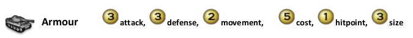

Special Abilities:
Armour has the ability to “Blitz” through empty enemy territories. This means that while
normally units must stop in the first enemy territory they enter, armour has the ability to keep
moving if the enemy territory is empty of enemy units. The blitzing unit conquers this territory,
and then can continue moving, going deeper into enemy territory or even returning to friendly
territory.
Notes: Armour is used for rapidly attacking an enemy, and being able to respond quickly to opportunities
that are too far away for infantry to reach in time.

<a id="fighter"/> 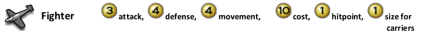

Special Abilities:
All air units in TripleA share 2 abilities:
 Air units cannot end the turn in a land territory which was fought over or conquered this
turn. In other words, they must move out of the territory where they fought, and land in
a territory that was friendly at the beginning of the turn, or on a friendly carrier which has
space left.

 Air units cannot capture territories.
Fighters can land on Aircraft Carriers.
Notes: Fighters are used for their flexibility in having 4 movement, and because they can attack both land
and naval targets. While all land units lose their movement when they participate in a battle, air units can
continue moving after a battle is finished, giving them the ability to get out of harm’s way in case the
enemy does a counter-attack.

<a id="bomber"/> 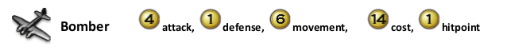

Special Abilities:
In addition to normal air abilities, Bombers have the ability to do a “Strategic Bombing Raid” on
any enemy factory. Generally speaking, each bomber that survives any AA shots will get to roll a 6
sided die, and do that much damage to the enemy’s PU supply or to the individual factory
(however the total damage per bomber cannot exceed the PU value of the territory).
Notes: The additional movement and attack, as well as the ability to raid enemy factories, make bombers
a deadly but expensive unit.

<a id="transport"/> 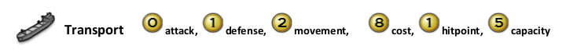

Special Abilities:
Transports have the ability to carry land units. They can carry 1 infantry unit plus 1 more land unit
of any kind (e.g. 2 infantry units, or 1 infantry and 1 artillery / armour / AA Gun.

In “Big World : 1942” and many other maps, Transports may be taken as casualties like any other
unit. However, in some maps, Transports may not be taken as casualties until all combat ships
are dead.
Notes: Transports are used for moving land units over the sea zones.

<a id="submarine"/> 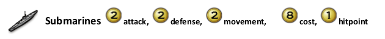

Special Abilities:
Submarines may “submerge” at the end of a round of battle, which effectively retreats them out
of a battle but keeps them in the same sea zone.
Submarines may move through enemy sea units, if the enemy units do not include a “Destroyer”
unit.
Submarines always attack at the beginning of each combat round. If the enemy has no
“Destroyers” present, any casualties the submarines inflict do not get to shoot back.
Submarines may not attack air units, ever. Air units may attack Submarines though.
Notes: Submarines are stealth units, and one of the cheapest units at sea, and are very useful in
attacking enemy sea units and for use as cannon fodder during sea battles.

<a id="destroyer"/> 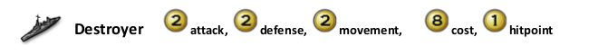

Special Abilities:
Destroyers have the ability to cancel all of the abilities of enemy submarines.
Notes: Destroyers are also one of the cheapest units at sea, and are better at defending since they can
defend against air units. It is good to have destroyers whenever the enemy has submarines.

<a id="cruiser"/> 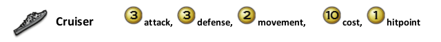

Special Abilities:
Cruisers have no special abilities on “Big World : 1942”, however on other maps they often have
the ability to bombard an enemy ground position.
Notes: A middle-cost sea unit.

<a id="carrier"/> 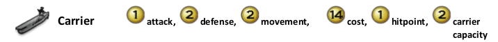

Special Abilities:
Carriers have the ability to carry 2 friendly (owned or allied) fighters over the ocean. These
fighters will help defend your fleet, and can be used to attack enemy positions out of range.
Notes: Carriers are useful only in their ability to hold fighters. Since fighters are more cost effective than
most naval units, they add greatly to your fleet’s abilities. (Technically, the carrier does not “carry” the
fighters, unless it is an allied fighter as cargo, it merely provided a landing place for the fighters at the end

of the player’s turn. When the player’s turn starts, all owned fighters are considered to have launched
from the carrier and are now in the air, so fighters and carriers move independently of each other.)

<a id="battleship"/> 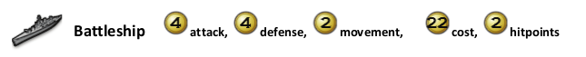

Special Abilities:
Battleships have 2 hitpoints. If damaged in battle but still alive after the battle ends, all
battleships will repair to full health after the battle is over.
Battleships can bombard enemy land territories, if there is a transport unloading ground troops
from the same sea zone into an amphibious assault on that land territory. So, if there is an
amphibious assault, the battleship may roll a single die at 4 before the battle begins in order to try
to cause an enemy casualty.
Notes: Battleships are used both for their ability to absorb and repair hits, and to bombard enemy
territories.

<a id="aa-gun"/> 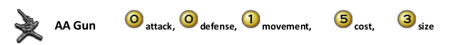

Special Abilities:
AA Guns have a special ability that activates before a battle or strategic bombing raid begins, and
when air flies over a territory containing an AA Gun. They will roll a single die at 1, for each
attacking aircraft in the battle. Any air that is hit immediately dies, with no chance to fire back.
AA Guns do not participate in battle, and if the attacker wins, the AA Gun is captured by the
attacker.
AA Guns may not move during combat movement, they may only move during the non-combat
move phase. They may never be on the attacking side of a battle, only on the defending side.
Notes: Anti-Aircraft Guns are used to defend against Strategic Bombing Raids, and are also used to make
an attacker think twice before they use overwhelming air power to attack your territories.

<a id="factory"/> 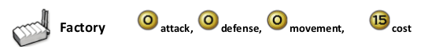

Special Abilities:
Factories allow their owner to produce units in the territory the factory is located in (or in the Sea
Zone adjacent to the factory). The Factory will allow production of any number of units, up to the
Production value of the territory it is in. Having multiple factories in a territory does not increase
this limit.
Factories do not participate in combat, and if an attacker conquers the territory they will
automatically capture any factories in the territory. Factories can be targeted in Strategic
Bombing Raids.
Notes: Factories are vital centers of production, allowing their owner to produce units in that location.

## <a id="sequence-of-play"/> 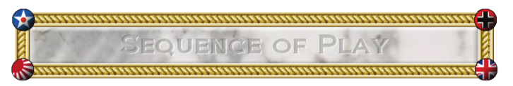

TripleA is played in a series of rounds, with each round
composed of a series of player turns, and each player turn
composed of a series of phases (also called steps).

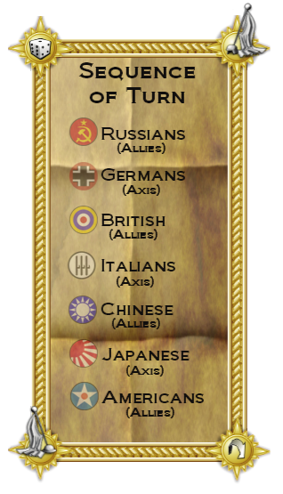

__The sequence of turns for Big World: 1942 is:__

1. Russians (Allies)
2. Germans (Axis)
3. British (Allies)
4. Chinese (Allies)
5. Japanese (Axis)
6. Americans (Allies)

Once the Americans finish their entire turn, the current
“round” is over. TripleA then checks for victory conditions to
determine if one side has won the game or not. If no side
has won, then the next round starts, beginning with the
Russians again.

__The standard sequence of phases is:__
1. Technology Development
2. Purchase
3. Combat Move
4. Battle (resolving combat)
5. Non-Combat Move
6. Placement
7. End of Turn (accounting)

A player may choose to do nothing in certain phases, and,
depending on the circumstances, some phases may not
occur. Almost all phases require the user to press a “Done”
button on the right side of the screen in order to progress to
the next phase.

## <a id="technology-development"/> 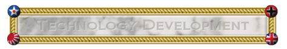

In the __Technology Development Phase__, a player may spend production units (PUs) to attempt to acquire new
technologies. This involves purchasing die rolls, and generally for every 5 PUs spent, 1 additional die is purchased
(a 1/6 chance each). The player then chooses which technology they wish to roll for, and then all of the dice are
rolled. If one or multiple 6’s are rolled, the technology is discovered and all dice are discarded. If no 6’s are
rolled, then nothing happens and the dice are discarded as well (in some maps, they player keeps the dice and
may roll during their next turn).
  
Technology generally improves a player’s units, or allows production of advanced units. Generally any
technologies discovered are then activated at the end of the player’s turn (though in some maps, the technologies
are activated right after they are discovered).
PUs not spent in this phase are saved for later use, like in the Purchase Units phase.
  

### Available Technologies

Once activated, Technology in “Big World : 1942” provides the following benefits. In other maps, different
technology may be available, or the same technology as below but with slightly different results (like ‘Jet Power’
increasing attack power instead of defense power). Technologies only affect the player who discovered the
technology, and do not affect any other players.

* Jet Power:
Each Fighter’s defense power is increased by 1.
* Super Subs:
Each Submarine’s attack power is increased by 1.
* Long Range Aircraft:
Adds 2 to all aircraft range.
* Rockets:
Your AA Guns gain the ability to launch rockets:
At the end of your combat move phase, each of your AA Guns may attack enemy factories within
3 movement away from the AA Gun. Generally each enemy factory can be targeted by only one
rocket, and rockets may only target one factory. The damage is a single 6 sided die, but limited to
the production value of the target territory, and the victim immediately loses that number of PUs
(or in some maps, the factory will be damaged instead).
* Destroyer Bombard:
Each of your Destroyers may conduct shore bombardment.
* Heavy Bomber:
Each of your bombers rolls 2 dice when attacking and raiding (if ‘LHTR’
rules is turned on, then only the better result is used. If not, then both dice count.)
* Industrial Technology:
All of your units cost one PU less. (Industrial Tech is considered an
‘optional technology’ and both players must agree to allow this tech before the game starts, otherwise it
should not be researched.)

For all of the technologies, except Destroyer Bombard and Industrial Technology, the units will visually change to
have new icons.

Some technologies available on other maps, but NOT available on “Big World : 1942”, are:
* Advanced Artillery:
Each artillery provided double the number of support (i.e.: supports up to 2 infantry instead of 1).
* Paratroopers:
Bombers may now transport a single infantry into combat. Neither
bomber or infantry can move before the infantry loads. The movement must be to a battle, and
movement ends in the first enemy territory reached.
* Increased Factory Production: Factories in territories valued 3 or greater may produce 2 additional units.
In addition, repairing is done at half price.
* War Bonds:
At the end of your turn, roll 1 die and collect that much income.
* Mechanized Infantry:
Each armour may transport a single infantry with it as it moves.
* Improved Shipyards:
Naval units are cheaper to purchase.
* Radar:
AA Guns now fire at +1 attack (2 instead of 1).

## <a id="purchase"/> 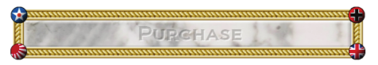

In the __Purchase Phase__, a player may spend PUs to purchase new units. These units may be placed on the map in
the Unit Placement Phase at the end of the turn.

At the start of the Production Phase, a menu appears offering the current player the chance to produce new units.
Any combination of available units may be purchased, subject only to the limitation that the total cost does not
exceed the available PUs. Any PUs not spent in this phase are saved for later use and accumulate without limit.
The unit purchase menu choices are to add or remove one unit of a given type, or to buy as many as possible or
zero of a given type. You may also enter a specific number with your keyboard. The unit purchase menu may be
closed and restored multiple times during the Purchase Phase and changes can be made freely, all without
penalty.

If a player attempts to purchase more units than can actually be placed on the map, the game provides a warning
and lets the player change their purchase choice, but the player is not actually prevented from doing so if they
insist.

In some newer maps, you may also repair damaged factories and units during this step. A factory that is damaged
produces less units (1 unit fewer for each point of damage), and so they must be repaired by a certain amount in
order to produce all the units you wish to purchase.

## <a id="combat-movement"/> 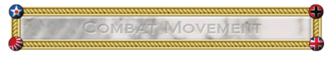

In the __Combat Movement Phase__, the current player may move any or all of his units to the full limit of their
movement allowance, with certain exceptions.

* Certain units, such as AA Guns, may not move in this phase, as they can only move in the Non-CombatMovement Phase.
* Air units may not move so far that their remaining movement allowance is insufficient for them to return
to an eligible landing area – that is, air units generally may not commit suicide in this manner. The
program does not always properly calculate ranges for fighters moving over large bodies of water; it
assumes that nearby carriers will move to pick up the fighters. A player could abuse this to circumvent
the “no suicide” rule. However, it is the player’s responsibility to ensure that each of his air units can
possibly land at the end of this turn.
* Land and sea units (except submarines if no enemy destroyer is present) must stop moving as soon as
they enter an area occupied by an enemy or neutral unit, or a neutral territory. Most land units having a
movement allowance greater than one may move through an empty territory controlled by an opposing
player without being required to stop, capturing that territory as they go. This is called “blitzing”. Neutral
territories normally cannot be blitzed.

Only in this phase may units enter into any form of combat situation. If a player moves units into a territory or
sea zone owned by the enemy, or containing enemy units, then the units must stop and participate in a battle
during the next phase. Unlike games such as “Risk”, you may not make a combat movement, then conduct
combat, then make more movement and conduct more combat. In TripleA, all movement to attack an enemy
must be made at once, during this phase, and after this phase is over all combat will be completed at the same
time. After this phase is finished, there will be no more movement to attack enemies allowed, until the player’s
next turn.

At the end of this phase, combat must be resolved for each territory or sea zone in which the current player has at
least one unit and an enemy player or neutral has at least one unit.
Units that do not use up their full movement allowance in this phase retain the remainder for the Non-Combat
Movement Phase, except for land and sea units that engage in combat. Land and Sea units that engage in combat
lose their remaining movement points.

Illegal moves are not permitted. If a move is attempted with a group of units that is illegal for some of those
units, a warning is given, and only the legal parts of the move will execute. For some complex moves, further
input is required, and the player will be asked to provide it.
As the movement phase progresses, a list of all moves made so far is displayed on the right side of the screen.
Any one of these moves can be cancelled and undone at any point until the player manually ends the phase,
except that moves that are prerequisites for other moves cannot be cancelled without cancelling the dependent
moves first.

__Transports__

Certain sea units (transports) may transport land units. A typical transport can carry one foot infantry and one
more unit, although this may be different on other maps.

The procedure is that a land unit moves onto a transport in an adjacent sea zone and later moves onto a territory
adjacent to the transport. The transport may move at any point in this process. The land unit may unload on the
same turn or later, and may remain on the transport indefinitely. Land units may load onto one transport from
different territories and at different times, but a transport may only unload to one territory per player turn, and if
it unloads, it may not move any more in that player turn. Land units may not move before they load onto a
transport.

Transportation may also occur with units of allied players, although the process is not as seamless as when the
transported units belong to the same player as the transport. This is because when you move a unit onto a
transport you own, you may unload that unit on the same turn. But when you move a unit onto an ally’s
transports, that unit may not unload until the next turn.

__Carriers and Fighters__

At the beginning of the turn, all of the current player’s owned fighters launch from any carrier they were on. They
are considered to be in the air, not on board a carrier.
This means that when you are moving the carrier, the air units do not move with it. Carriers cannot be used to
give air units ‘extra’ movement.
All owned air units stay in the air until the end of the current player’s turn.
The only exception is that allied air units remain on-board a carrier, and do not launch. These air units are
considered to be “cargo” and do not participate in attacks. If the carrier dies, the allied air “cargo” will die too.

__How to Select and Move Units__

* To pick up a unit, left-click on that unit.
Then move your mouse to the territory where you want the unit to go, and left-click again to move it
there.
* Do NOT left click and drag your mouse at the same time. Instead you have to click, then move the mouse,
then click again.
* To de-select the last unit selected, right-click. To deselect a specific unit, right-click on that unit’s stack.
* In addition to these basic methods, there are some more shortcuts
  * CTRL-Left click on a unit stack to select all units in the stack.
  * CTRL-Right click on a unit stack to de-select all units in the stack.
  * Shift-Left click on a unit to select all units in the territory.
  * CTRL-Right click somewhere not on a unit stack to de-select all units. Or hit ESC to deselect all.
  * Left click in the territory, but not on any unit, to bring up a menu allowing detailed selection of
multiple units.

## <a id="battle"/> 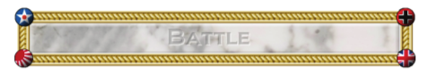

In the __Battle Phase__, each territory or sea zone where both the player has units, and any enemy has units, will
create a “battle” that must be resolved. A list of these territories and sea zones will appear on the right side of
the screen. The current player may resolve these in any order he wishes, but there are some exceptions, such as
amphibious invasions and strategic bombing raids, which must be done first, but all battles must be resolved
during this phase.

If a territory contains more than 2 different players (nations), then only the units owned by the current player are
considered to be “attacking”. Any units which are enemies of the current player are considered to be “defending”
(including all air units on carriers). In this way, many nations may defend, but only one nation may attack during
each turn. Multinational attacks are not possible in most maps.

Each battle proceeds in a series of rounds, until at least one side is destroyed or retreats. The attacker may retreat
at the end of any round. Both defending and attacking subs (stealth units) may retreat (submerge) at the end of
any round if no enemy destroyers are present (in some maps, submarines may retreat before the battle starts as
well).

Each combat round proceeds in a series of segments. Unless otherwise specified, all units of both attacker and
defender get to fire once per battle round, even if the unit is selected to be a casualty. The segments of battle are
as follows:
1. First, attacking subs (stealth units) fire, and the defender allocates the casualties. If the defender has no
anti-stealth units (destroyers) present, the non-submarine casualties are removed immediately and do
not participate further in this combat.
2. Next, defending subs fire using the equivalent procedure. If the attacker has no destroyers present, the
casualties are removed immediately and do not participate further in this battle.
3. Next, any remaining attacking units fire, and the defender allocates the casualties.
4. Next, any remaining defending units fire using the equivalent procedure, and the attacker allocates
casualties.
5. Allocated casualties are now removed from the game. If one side has no more units, then the other side
wins (and if the attacker wins, they conquer the territory).
6. If the defender has any submarines, they may choose to submerge them now. The attacker may then
choose to submerge their submarines.
7. The attacker then chooses whether to retreat, or press on. If the attacker retreats, then all non-air units
must move to a single territory where at least one non-air unit originated from. The air units will stay in
this battle territory and must be moved during the non-combat movement phase. If the attacker presses
on, then the battle continues with a new combat round.

__How Units “Fire” at the enemy:__

Each unit in the game has a certain attack power and defense power (for example, infantry have 1 attack and 2
defense). This means that during battle, their owner will roll 1 die for each infantry they have. If the infantry are
attacking, then the owner will score 1 “hit” for each die that shows a “1”. If the infantry are defending, then the
owner will score 1 “hit” for each die that shows a “2” or less (“1” or “2”). This is called “rolling at 2”.

So for example, if you had 3 infantry and 1 tank defending, you would roll “3 at 2, and 1 at 3”, because you have 3
infantry defending ‘at’ 2, and 1 tank defending ‘at’ 3.

For each “hit” scored, the enemy must allocate 1 casualty.

Special Cases:
Subs cannot inflict casualties on air units, ever.
On some maps, air units cannot hit submarines unless a destroyer is present in battle (in Big World, air
units can hit submarines without a destroyer present).
Some units, such as battleships, are so large that it takes two hits to destroy them. The first hit only
damages them. The damage has no effect on the unit’s firepower or stats. Damaged battleships are
automatically repaired at no cost at the end of the player turn.
Any land units being carried by transports do not fire, or participate in combat in any way. Likewise, allied
fighters on attacking carriers will not participate. This means they do not fire, and may not be selected as
casualties.
It is important to note that, excluding the exceptions listed above, all units may hit all other units. This is because
TripleA is a grand strategy game engine, and therefore a single unit actually represents an army, fleet, or air
command. Each round represents 3-6 months of time, and all engagement and combat over that time.

__Amphibious Combat__

Land units may unload from transports into a battle. Combat is resolved normally, with a few exceptions:
* If there is a combat in the sea zone from which the invasion came, that combat must be resolved before
the combat including the invasion. The attacker must win the sea combat, and the relevant transports
must survive. If transports sink, the land units being transported will die with them, and therefore not
participate in the amphibious battle.
* Each attacking unit with bombardment ability (battleships) in the same sea zone as the invading
transports may use its firepower in a special one-shot “bombardment”, as long as it did not participate in
any combat this turn. If the battleship rolls its firepower or less on one 6-sided die, and hits, then the
defender must immediately remove one unit from the defending force. The bombardment casualty does
not get to return fire. (In some maps, you may not have more bombardment rolls than the total number
of amphibious attackers, and in addition, the bombardment casualty will get to fire during the first
combat round, before dying.)
* The invading amphibious units may not retreat.

## <a id="non-combat-movement"/> 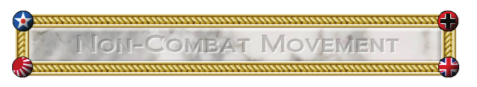

In the __Non-Combat Movement Phase__, the current player may move any or all of his units to the full limit of their
remaining movement allowance, with certain exceptions.

* Air units must “land” in this phase. This means that they must end this phase in a territory that was
controlled by the current player or an ally at the beginning of this player’s turn, or (for fighters only) in a
sea zone containing an eligible friendly or allied carrier.
* Air units may not commit suicide or be dashed into the ocean. If still alive after the battle phase, all
fighters must return to friendly land or move to carriers, or carriers must move to pick them up. Carriers
have limited space, and may not be filled beyond capacity (in Big World and most other maps, Carriers
have space for 2 fighters).
* Land and sea units that participated in any form of combat in this player turn may not move in this phase.
Transports that unloaded this turn may not make any further movement.
* Units moving in this phase may not initiate any form of combat, including blitzing. That is, land and sea
units may not enter any territory controlled by an enemy or neutral, or any sea zone containing an enemy
or neutral unit.

Certain units, such as AA units, may move only in this phase, unless they are cargo in transports.
Transport rules still apply, and units can be loaded and unloaded in either combat or non-combat movement
phases.

## <a id="placement"/> 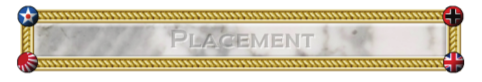

In the __Placement Phase__, units that were bought during the purchase phase at the beginning of this turn may be
placed on the map.

Any newly purchased factories can be placed in any territory that was owned by the current player at the
beginning of the turn. These new factories may not begin producing units until the next turn.

Generally, land and air units can only be placed in owned territories containing factories that were owned at the
beginning of the turn.

Sea units can only be placed in sea zones that are adjacent to factories owned at the beginning of the turn.
If purchasing one or more Carrier units and 1-2 Fighter units per Carrier, then the Fighter units may be placed on
the Carrier in the sea zone. In addition, when placing a new Carrier unit, you may move up to 2 Fighters from the
adjacent factory-holding land territory, to the new Carrier unit. (However, in some maps you may not make this
‘free’ movement, and instead must move the Fighters there during the non-combat movement. In these maps
you may also place new Fighter units on already existing adjacent Carriers.)
The maximum number of units placed at a factory in one player turn is equal to the production value of that
territory. This includes sea units built in adjacent territories.

It is possible to place new units into sea zones controlled by an opposing player. This does not require combat
resolution unless the situation persists until the end of the enemy’s next movement phase.

The exact procedure for placing new units is to left-click on an eligible territory or sea zone. At this point, a menu
listing units available for placement there will appear. These menus may be closed and restored multiple times
during the Placement Phase and changes can be made freely, all without penalty. After all available units have
been placed, these menus will no longer appear, although “undo” is still available. Unit placements are listed on
the right as they are made, and the placements can be undone at any time.

In a situation where several factories are adjacent to one sea zone, and a mix of land, air, and sea units are to be
placed by each factory, the TripleA engine may not always calculate correctly which factory you wish to use to
place the sea units. In this case, the land and air units should be placed first.

When all available units have been placed to the player’s satisfaction, he can manually terminate the Placement
Phase by pressing “Done” on the right side of the screen. While there is usually no good reason to do so, a player
is not forced to place all units before terminating this phase. Any units that were not placed are removed from
the game (in some maps, the units may be retained and placed during the player’s next turn).

Newly placed units are fully functional at the end of this phase, meaning that they can be used for defending if
attacked during the next player’s turn.

## <a id="end-turn"/> 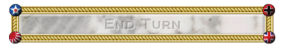

In the __End Turn Phase__, TripleA will automatically do all of the following actions, with no input required by the
user.
1. Activate any technologies that were successfully researched during the Tech Development phase.
2. Count all of the income from owned territories and give that income to the current player.
3. If the map includes any bonuses for capturing certain objectives, these bonuses will be checked for and
given out now. (As an example, a map may give an additional X pu’s for controlling a strategic territory,
such as Egypt.)
4. In addition, any other end-of-turn effects occur. If a map has anything extra, it will list it in the Game
Notes.

At the end of this phase, the next player may start their turn.

## <a id="winning-the-game"/> 

Normally “Victory” is determined by one player surrendering the game
once they believe it is impossible for them to win. However, most maps,
including “Big World” include default ‘victory conditions’, which the players
can play too if no surrender is forthcoming. Normally victory is determined
by controlling a certain number of strategically important territories, called
“Victory Cities” (VCs), which are indicated on the map by small yellow stars.
Depending on which victory condition is chosen during game setup, victory
in “Big World” occurs when one side controls 14-17 victory territories (the
default is 17).

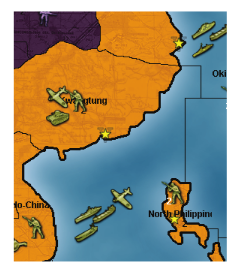

The Victory Condition is normally tested at the end of every round.

Victory City marker: 

## <a id="undo-feature"/> 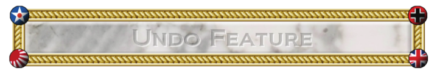

TripleA is a turn-based strategy game. Generally, this means that a player can
spend as much time as he wants on any aspect of his move, and can freely
change anything he does during the turn without penalty, until he manually
ends a phase.

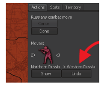

There are no time limits, though human players will generally appreciate faster
play.

Live games, played on the lobby, network, or on the same computer (hot-seat),
are generally played faster. Play-By-Email (PBEM) and Play-By-Forum games
allow for much more time to consider and reconsider all actions.

## <a id="low-luck-vs-dice"/> 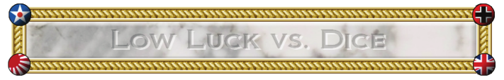

TripleA is a dice game, and as such there is a significant amount of luck present in each battle (though it will tend
to even out over a long game, or series of games).

Since many players disdain the uncertainty created by the high variability of dice, we have created a system called
“Low Luck” (LL).

In “Normal Dice”, one die is rolled for each unit participating in a battle.

In “Low Luck”, all of the attacker’s units have their attack powers added together. The total is then divided by the
dice sides (6), and if there is any remainder it is rolled for. The defender does the same with the defense powers
of all their units.

As an example, consider Germany using 4 armour to attack Russia, which is defending with 2 infantry plus 1
armour.

Round 1 of Battle:

Germany will take the attack power of each of her units and add them together. The total is 12 attack power (4 x
3).
21

This is then divided by 6, giving us 2 hits, and zero remainder.
Russia now selects 2 units to be allocated as casualties, and chooses her two infantry.

Now it is Russia’s turn to fire. The total for her is 7 defense power (2x2 + 1x3).
This is then divided by 6, giving us 1 hit, and 1 remainder.
Russia now rolls 1 die at 1, to see if she gets 1 more hit. We will pretend she misses for this example.
Germany now selects one of his armour to be a casualty.

Both sides now remove their casualties. Germany has 3 armour left, and Russia has only 1 armour left. Germany
may now decide to retreat or keep fighting.

## <a id="battle-calculator"/> 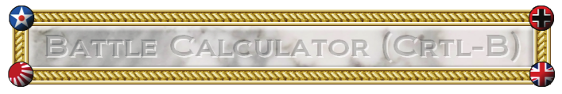

What is the expected outcome of this battle? How likely is it? These are questions that TripleA players, and
wargamers in general, ask a lot, or at least they should.
Specifically, consider a turn 1 Russian attack into Finland in Big World.

In Finland, Germany has 2 infantry, each defending at 2.
The obvious starting point for this battle is Russia’s 3 infantry in Karelija. What are the chances of winning? How
many more attack units should Russia add in order to win? There are 2 armour units nearby that could be used.
If these are added, then the Russians have 9 total attacking power and 5 units (five hitpoints), while the Germans
have 4 defending power and 2 units. This is obviously overkill, but can we be more scientific?

Assuming that Low Luck (LL) rules are in effect, the Russians will kill 1.5 units on round 1, and will probably lose
one infantry. On round 2, if it happens, the Russians might lose a second infantry. Overall, the Russians will lose
about one infantry but no more than two. Exact analysis shows that the Germans will get zero hits 5 times out of
18, one hit 11 times out of 18, and 2 hits 2 times out of 18. On average, the Germans will kill 5/6 of a Russian
infantry on the first round, and possibly more if Russian’s miss their shots and the battle goes multiple rounds, so
on average the Russians expect to have approximately 4 units remaining.

This calculation is relatively simple, but what if more units are involved? Fortunately, TripleA provides a handy
utility called the Battle Calculator. It can be accessed through the Game menu, the Territory tab, or by hitting
CTRL and “B” at the same time while your mouse is over the desired territory. It allows the player to calculate the
expected outcome for any possible battle within the game, by simulating the battle occurring multiple times. If
you use the CTRL-B shortcut while your mouse is over a territory containing a battle, then the battle calculator will
automatically load the units in the battle.

## <a id="menus-and-tabs"/> 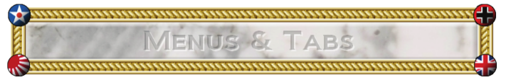

When a game is running, several menu options are available at the upper left of the screen, as well as three or
more tabs just below the minimap on the right side.
Most of the menu options are either fairly unimportant or quite obvious in what they do. The most important
non-obvious ones are described below:

* “Help -> Game Notes”. The ‘game notes’ are specific notes made by the person who made the map or
mod you are currently playing. These notes often describe specific rules that this game variant follows,
what each unit does, and any other things that the map maker thought important for you to know. It is
definitely a good idea to read these before playing a map!
* “Game -> History”. By going to the ‘game history’ you can go back in time through all the steps to see
each action that was taken by all players. By clicking on a specific round or step or action, the main screen
will adjust to look just like the game looked like at the time when that action took place.
* “Game -> Edit Mode”. Edit mode allows you to perform actions that are normally illegal, or to adjust the
game board in any way (like adding extra units, or deleting units, etc). The actions are recorded in the
game history though.
* “View -> Show Map Details”. Map Details normally defaults to “true” when a map has them. Map Details
(also called “reliefs”) is art that is shown on the game board. While normally visually pleasing, sometimes
this art can cover up features you want to see, or make it hard to see who owns what territory. To view a
map without art, and just see bare political boundaries, turn Map Details off.
* “View -> Map Skins”. Some maps come with multiple sets of art. You can switch between these art sets
by selecting a different map skin here.

Tabs:

If the __Actions tab__ is selected, then a list of all actions that have been ordered for the current phase is presented,
and buttons are available to permit easy modifications. This can be considered the “default” tab.

If the __Stats tab__ is selected, then important game information such as the income for each player, how many units
each one has, and what technologies have been developed are listed. The players are listed in turn sequence.

If the __Territory tab__ is selected, then moving the cursor over the map causes the contents and names of the map
areas to be displayed below the minimap. (The names of the map areas and production values are displayed at
the lower left of the main map widow at all times.) This can be very useful, especially for densely occupied maps
where it can otherwise be hard to determine exactly what is going on in a given map territory. The Battle
Calculator can also be accessed through this tab, but a player will rapidly learn that it is better to know the
keyboard shortcut.

## <a id="credits"/> 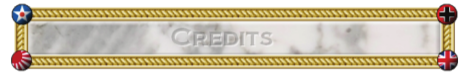

This manual and rulebook was created by:
* Victor Finberg (VictorInThePacific)
* Mark Christopher Duncan (Veqryn)
The art in this document was created by:
* Hepster

TripleA the game engine was originally created by Sean G Bridges, and was maintained by him until 2009 (TripleA
version 1.2.5.5).

After 2009, the main developer has been Mark Christopher Duncan (Veqryn).

While many different things have inspired the creation of TripleA, and indeed as an open-source project we have
many different contributors, one of the main inspirations has been Larry Harris, the creator of “Axis & Allies” (fully
owned by Hasbro ®).

## Links

TripleA Downloads:
Place to Report Bugs:

https://sourceforge.net/projects/triplea/files/
http://sourceforge.net/tracker/?group_id=44492

TripleA Development Site:
TripleA Dev Forum:
TripleA Guides, Installing help:
TripleA Donation Page:

http://triplea.sourceforge.net/mywiki
http://triplea.sourceforge.net/mywiki/Forum
http://triplea.sourceforge.net/mywiki/Guides
http://triplea.sourceforge.net/mywiki/Sponsors

TripleA War Club:
War Club Forum:

http://tripleawarclub.org/
http://www.tripleawarclub.org/modules/newbb/

Axis And Allies .org:
AxisAndAllies.org Forum:

http://www.axisandallies.org/
http://www.axisandallies.org/forums/

Official Map Repository:

https://sourceforge.net/projects/tripleamaps/

## Appendices and Additional Content

## Example of Play: 1st Turn Walkthrough of Russians in "Big World: 1942"

Example of Play: First Turn Walkthrough of “Big World”
First of all, we have installed TripleA on the desktop of a PC and started the game. The setup window appears.

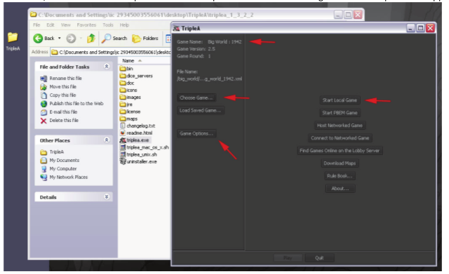

In order to begin this walkthrough, we must make sure that we are playing the correct game.
The “Game Name” in the upper left should read “Big World : 1942”.
If it does not, please click on “Choose Game…” and then select it from the menu.

In order to decrease the randomness, for the sake of tutorial purposes, we are going to change the game from its
default of “Dice”, to “Low Luck”. You may also want to turn “technology development” off for now.
To do so, click on “Game Options…” and then make sure that the “Low Luck” checkbox is checked on.

Finally, we wish to start a local game (“local” means that all the players will use your computer to play). So click
“Start Local Game”. (Even when loading games, you must choose a method of how to play them, either by
clicking “Start Local Game” or “PBEM” or “Network” or “Lobby”. The savegames do not remember which method
you used to start them, and this is intended.)

Now you must select who will be playing each of the nations. You will be playing as the Russians, so leave
“Russians” as “Human”. If you are playing against a friend (perhaps by sharing the computer each turn,
something called “hot-seat mode”), then leave the other nations as “human”. If not, you can set your opponents
to be AI’s. We generally recommend playing against the “E.Z. Fodder” for your first time, and once you
understand how to play, you can upgrade the challenge to “Moore N. Able”. The “Dynamix” AI is still being
worked on, and as such it generally does not make any sea movements, and also may have bugs that crash the
game. After selecting who will play each of the nations, click on “Play” in order to begin.

__The Game Begins…__
When the game starts, the map is focused on the main territories of Russia. You can use your mouse to scroll
around the map (right click and drag the main map, or click or click and drag on the minimap). As you can see, the
German front line has pressed all the way up to the main cities of Russia: Leningrad, Moscow, and Stalingrad. In
addition, the Far East has seen the Japanese claim Port Arthur and Manchuria, putting masses of armies right on
the border with Russia. Be sure to also notice Russia’s small fleet.

__Technology Research Phase__
We are given the option of spending resources on tech. Russia is both poor and under attack, so it is a good idea
not to spend any money on technology. In the upper right of the screen, click “Done” to continue to the next
phase.

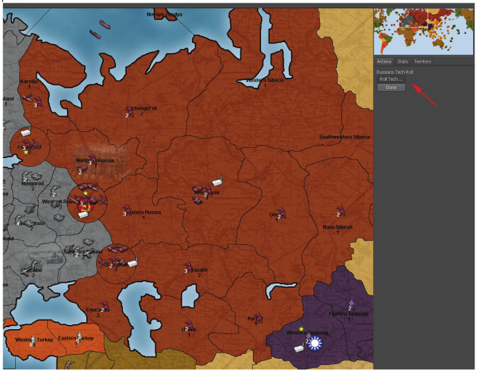

__Purchase Phase__
A production window will appear. Here you can see the basic stats of each of the units you can purchase, and for
more detailed information, you can hold your mouse over a unit’s picture for a moment, causing a tooltip to
appear. Russia should buy mostly infantry for a very long time, as they are the most cost-effective defenders and the
cheapest units. In order to counter-attack, you will need to rely on artillery and air power. Armour is a bad buy
because it is subject to destruction on counter-attack. 10 infantry + 1 artillery is a reasonable first-turn production
(other reasonable purchases are 7 infantry + 2 artillery + 1 tank, or 8 infantry + 1 fighter).

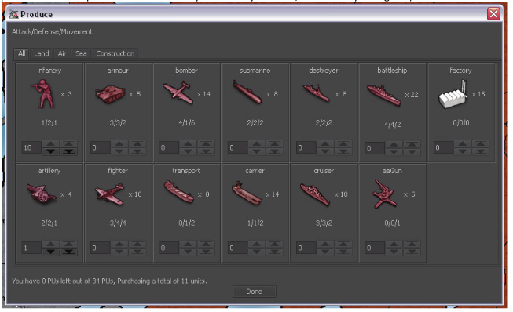

If you click “Done” on the production window before you are really done, do
not worry, as you can still change your purchase as long as you have not yet
clicked “Done” on the right-side panel. Russia has 4 factories, and only 3
are on the front line. Adding up the values of each territory where you have
factories, you see that you can produce no more than 12 units per turn, of
which 9 could be on the front line with Germany and 3 further back.
Supposing you decide that you want to produce fewer units, because the
front-line factories can only produce 9 units total. So let’s produce 7
infantry, 2 artillery, and one armor instead (click “Change…” to do so).

When finished, click “Done”.

__Combat Movement Phase__
In the Far East, you notice that you can attack Northern Manchukuo with a total of 5 infantry (5@1), against a
total of 2 infantry (2@2). If you were playing with “normal dice”, this would be a risky attack that most
commanders would avoid even though you have a good chance of success. Since we are playing using “low luck”,
this battle would be easily won with near-certainty.
However, as a commander, you need to look ahead not just to the end of your battles, but to what might happen
on the opponent’s turn, and maybe even beyond that. If you attacked Manchukuo, your infantry forces

(representing about half of your total Far East forces) would be left exposed to a devastating counter-attack,
especially since Japan has significant air capabilities. With half of your forces wiped out, you would be forced to
give up much of the Russian Far East. Because of this, we choose not to attack, meaning no combat movements
are needed in the East for Russia.

On the Western Front (from the Russian perspective), we will crush the Germans wherever we can. It is important
not to let Germany get close to your factories, so we must push them back. We will conquer 4 territories and try
for one submarine.

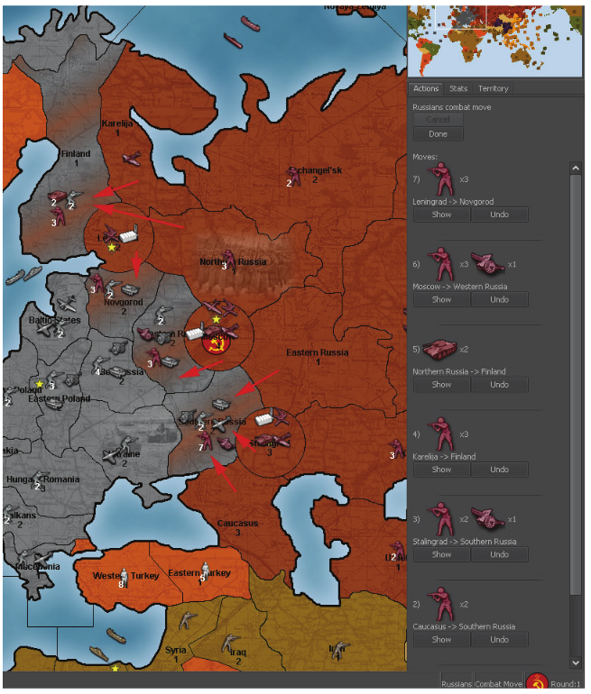

We will attack Southern Russia with all the adjacent infantry and artillery that can’t attack anywhere else. We
have 7 infantry and 1 artillery (10 attack power) and 8 hitpoints VS. 13 defense power and 5 hitpoints (2 infantry,
1 artillery, 1 armour, 1 fighter). This battle strongly favors the Russians because of our advantage in hitpoints.

We will attack Finland with 3 infantry from Karelija and 2 armor (9 attack power and 5 hitpoints VS. 4 defense
power and 2 hitpoints). This is an easy win for Russia, and our tanks cannot easily be counter-attacked since
Finland is separated from the German reserves in Eastern Europe.
We will attack Novgorod with 3 infantry from Leningrad and we will attack Western Russia with 3 infantry + 1
artillery from Moscow.

At this point, we still have more forces to commit, and it looks like we can take out one submarine as well.
We throw 2 tanks into the S. Russia battle, because we want lots of troops left there, so it will be difficult to
counter-attack them.
We add 2 infantry, a bomber, and a fighter to the Novgorod battle, to ensure that we win it.
We add a fighter, an infantry, and a tank to the W. Russia battle, since we would prefer to not take so many
casualties in this battle. (Generally speaking, the longer a battle goes on, the more casualties the defender will
cause to the attacker. The attacker should aim to destroy the defender in as few rounds as possible.)
29

This leaves the entire Russian navy plus one fighter to take out one German submarine.
Destroying the submarine is important because it helps to protect the British navy.
This is a really strong Russian offensive, and it may not be the best possible Russian Turn 1, but we will leave it to
you to figure out a better strategy. We now end this phase by clicking “Done”.

__Battle Phase__
We have 5 battles, which we can resolve in any order we wish.
Generally speaking, it is best to resolve the ‘most critical’ battles
first; that way we can decide if we need to retreat from other less
critical battles, or choose casualties in a specific way. However, for
this example play-through, we will just go down the list. To start a
battle, just click on the buttons on the right side (and to show
where a battle is, click on the “Center” button).

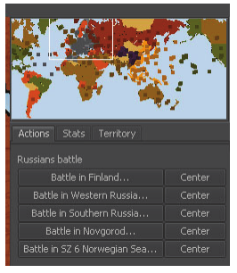

1st Battle: Finland

Here we have the Russians with 3 infantry (rolling @1), and 2
armour (rolling @3). The Germans are defending with 2 infantry
rolling @2. You can see what number each unit is rolling at by
looking at which column it is in.
For our battle, the Russians have a total of 9 attack power, meaning that using Low Luck the Russians will
automatically get 1 hit, and will roll a die @ 3 to determine if we get 1 more hit or not. (9/6 = 1, with 3
remainder).
We roll a 5, meaning we
miss the chance for the
second hit.

Now the Germans have
their chance to roll. With
a total of 4 defense they
get no automatic hits,
and must roll a single die
at @ 4 to determine if
they get any hits. (4/6 =
0, with 4 remainder).
The Germans roll a 3,
meaning they hit us.
We choose to lose one of
our cheapest units, an
infantry. Since we still
have great odds, we
choose to continue the
attack.
30

On round 2 of the battle, we kill the remaining German infantry.
The Germans get to shoot back though, but they miss their roll by getting a 4 when they needed a 1 or 2.
The end result: the Russians lose 1 infantry, while the Germans lose 2 infantry. The Russians now conquer Finland
(and Finland turns red to show this).

2nd Battle: Southern
Russia
This battle does not go as
well for us as we had
hoped for, but we still
manage to win.
The Russians lose 5
infantry, but the Germans
lose all of their units,
including an expensive
fighter.

3rd Battle: Novgorod
In Novgorod we win
handily, losing only one
infantry. We have 4
infantry and 1 bomber
and 1 fighter left.

4th Battle: Western Russia
Here Russia wins, losing 2 infantry. We are left with 2 infantry, 1 artillery, 1 armour, and 1 fighter.
5th Battle: Norwegian Sea (Sea Zone 6)
In this battle, the two submarines fire first. Unfortunately ours misses, and the German’s hits. We take a
transport casualty. After this, our fighter rolls, getting a hit and killing the German sub.
If our fighter had missed, the German submarine would have a chance to submerge, effectively ending the battle.
(The AIs almost never submerge, but human players do.)

In all the combat resolutions, just use common sense, and mostly do what the game tells you to do. The battles
pretty much play themselves. Sometimes, you may wish to choose different casualties than the engine suggests,
and often you must make a hard choice about whether to retreat or continue.
31

__Non-combat movement__

First, we must “land” all of our aircraft. The fighter that attacked the German submarine should land in Karelija.
The 2 other fighters land in Leningrad, and the bomber lands in Moscow. Defending Leningrad with fighters,
especially British fighters, is key to Russian survival. Russia must hold onto Leningrad for as long as possible, and
fighters defend at 4, making them very good at this when backed up with sufficient infantry.

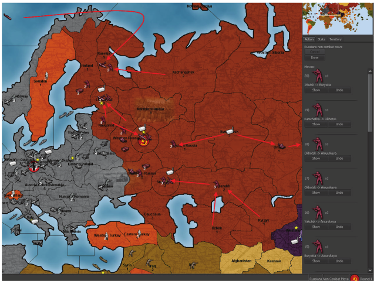

In the middle, all the Russian infantry heads for the German front. The single artillery in Sverdlovsk, and the 2
infantry in Omsk, will head to the east to provide some attack power in case the Japanese get greedy.

In the East, send all of your units to meet in Amurskaya. Continue to move them each turn, and watch how strong
the Japanese are. If the Japanese get too strong, or have enough aircraft in the area, you may be forced to move
back to Buryatia in order not to lose your forces.

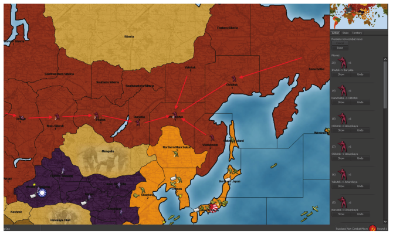

When you are ready, end the phase by clicking “Done”. If you should forget to land a plane, you will be told. If
this happens, you can force the plane to commit suicide or you can go back and continue making moves.

__Unit Placement Phase__

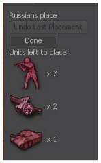

In order to place the units that you have purchased, you must ‘left click’ in any or each
of your territories that contains a Factory or unit which has the ability to produce
other units. To place sea units, you must click in a sea zone next to a territory
containing a factory unit.
You have a total of 10 units to place: 7 infantry, 2 artillery, and 1 armour. We start by
placing units in the most important territories.
Click on Leningrad, and use the menu that appears to place one infantry and one
artillery there.
Click on Moscow, and place 4 infantry.
Click on Sverdlovsk, and place the armour there. This unit can use its extra movement to reach either front
quickly.
Click on Stalingrad, and use the ‘max’ button to place the remaining 2 infantry and 1 artillery there.

When finished, hit “Done”, and the Russian turn will end. The
TripleA Engine will calculate your total production for the turn by
adding up all the territories owned by Russia, and give you that
many PUs. Because of our attacks, Russia receives 41 PUs this
turn.
Now the German player begins their turn.

__Analysis of the luck factor for Russian turn 1__

The low luck system can make battles more deterministic (less luck-dependent), but at the cost of removing some
of the risk and changing how the game is played. Basically, every 6 firepower points guarantee one hit, and you
only roll for the remainder. But you still have to set up the battles to make the system effective. For example, a
battleship-on-battleship encounter is completely random, and the swing is huge. But a bomber plus two infantry
attacking a fighter under low luck rules guarantees that the fighter dies in one round, taking a maximum of one
infantry with it. Sending a bomber plus 1 infantry leaves this battle up to luck completely, while sending 1
bomber plus 3 infantry is unnecessary since you only need 1 hit to kill the single enemy fighter.
Most of the Russian attacks in the Example of Play are easy to analyze, especially because using lots of lowfirepower units means that their combat value degrades very slowly. Accordingly, the details are left to the
reader.

Norwegian Sea:
Finland:
Novgorod:
W. Russia:
S. Russia:

3 + 2 sub + 0
3x1+2x3
5 x 1 + 2 art + 2 x 3
4 x 1 + 2 art + 2 x 3
7 x 1 + 2 art + 2 x 3

vs. 2 sub;
expecting 0-1 loss;
vs. 2 x 2;
expecting 1 loss (1.5 rounds);
vs. 2 x 2 + 3;
expecting 2 losses (2 rounds);
vs. 3 x 2 + 3;
expecting 2.5 losses (2 rounds);
vs. 3 x 2 + 3 + 4; expecting 3.5 losses (2.5 rounds);

lost 1
lost 1
lost 1
lost 2
lost 5

Overall, Russia lost just a bit more than expected, but nothing out of the range of general variability.
Remember that if you make 20 attacks, each of which has a 95% chance of winning, on average you will lose one
of those attacks. Just because the Battle Calculator says that you have a 95% or even 99% chance of winning,
doesn’t mean you should not prepare for the possibility of losing that battle.

34

__Strategy analysis__

Germany’s primary turn 1 objective is to at least cripple the British navy. After that, the British concentrate their
ships and cause the Germans no end of trouble. Russia must do what it can to help the British on turn 1.
Therefore the primary Russian objective on turn 1 is to exert maximum pressure against Germany, while building
up defense forces against the coming retribution. After turn 1, it becomes Britain’s primary responsibility to do
everything it can to help the Russians.

We can see that Germany cannot effectively attack both the British navy and Russia, because they have only so
many aircraft, so by forcing this choice either the Allies will have plenty of time to build up a defense of Russia,
leading to a long-term Allied win, or the British maintain their fleet, which may lead to an early Allied win.
In the Far East, Russia puts on a strong immediate defense, which can be converted to a good delaying action.
Considering that Britain and China move before Japan, the Japanese will have great difficulty expanding in Asia for
a long time, which gives the Americans time to build up.

